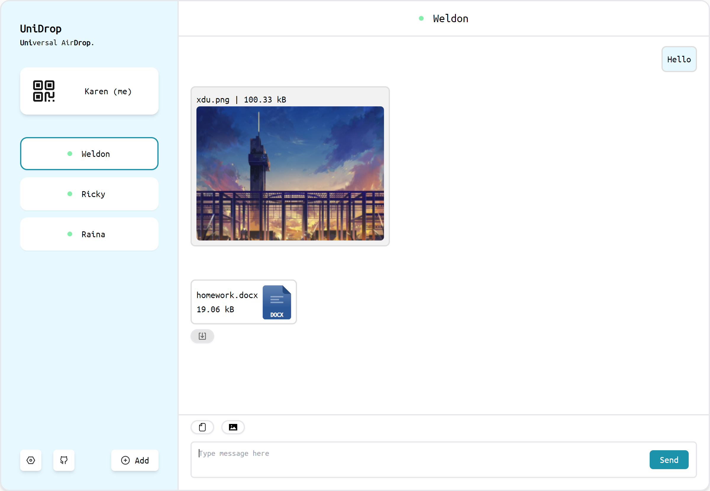
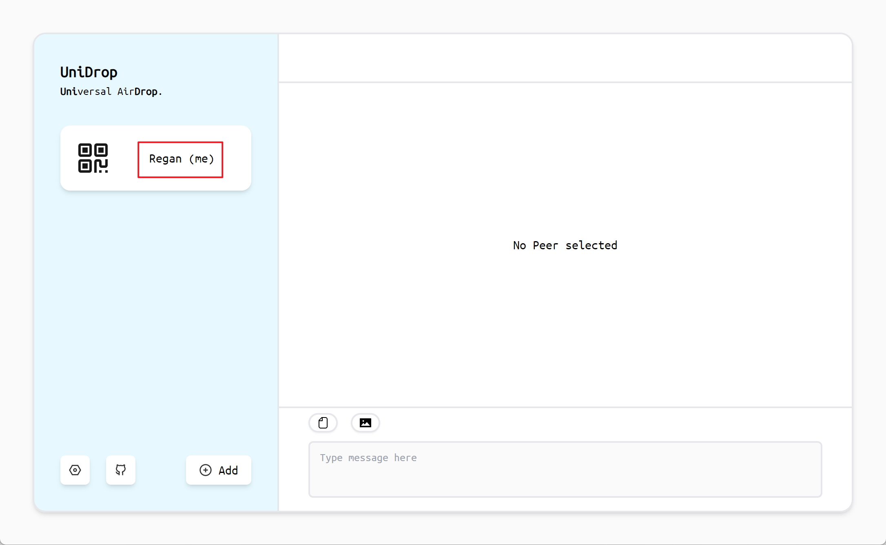

# UniDrop

English | [简体中文](./README_zh-CN.md)

`UniDrop` stands for "Universal AirDrop," which allows for convenient transfer of text, images, and files between different devices.

## Quick Start

Visit [unidrop.top](https://www.unidrop.top) to use UniDrop.

## Features

- Web-based, no need to install an application
- Built on WebRTC, enables peer-to-peer connections without server relay, maximizing (local network) bandwidth
- Supports the transfer of text, images, and files
- Supports multiple node discovery methods: local network, QR code, Pin, URL, PeerID
- No registration required, ready to use out of the box

## Usage

### Prerequisites

- Use a mainstream browser (Chrome, Firefox, etc.)
- The device can connect to the public network

### Node Initialization

After opening the web page, the node will be automatically initialized. Once the initialization is complete, the node's name will be displayed.

As shown in the image below, the node's name is `Regan`.

### Node Discovery

Various methods can be used to establish connections between different devices.

#### Local Network

When devices are on the same local network, the local network can be used for node discovery.

Both Device A and Device B open [unidrop.top](https://www.unidrop.top). After waiting for about 10 seconds, Device A and Device B will automatically discover each other.

#### QR Code

Device A clicks on "me" to display a QR code to Device B.

Device B scans the QR code displayed by Device A.

#### Pin

The Pin code is a 4-digit number that can be easily spoken or entered.

Device A clicks on "me" to send a Pin code to Device B.

Device B clicks on "Add" and enters the Pin code.

#### URL

Device A clicks on "me" to send a URL to Device B.

Device B opens the URL.

#### PeerID

Device A clicks on "me" to send a PeerID to Device B.

Device B clicks on "Add" and enters the PeerID.

### Sending Messages

First, select the target node and ensure that the connection status is normal (green dot).

- Sending text messages

  After entering text in the input box, click the Send button or press Enter to send the text message.

- Sending file messages

  Click the file selection button on the toolbar, select a file, and then send the file message.

- Sending image messages

  Click the image selection button on the toolbar, select an image, and then send the image message. The recipient can preview the image in the chat window and also download the image.

## Deployment

If you need to deploy UniDrop on your own, you can refer to the [deployment documentation](./docs/deploy.md).

## Development

If you need to develop UniDrop, you can refer to the [development documentation](./docs/develop.md).

## Acknowledgments

[ChatGPT-Next-Web](https://github.com/Yidadaa/ChatGPT-Next-Web) provided inspiration for the UI design and some SVG icons.
