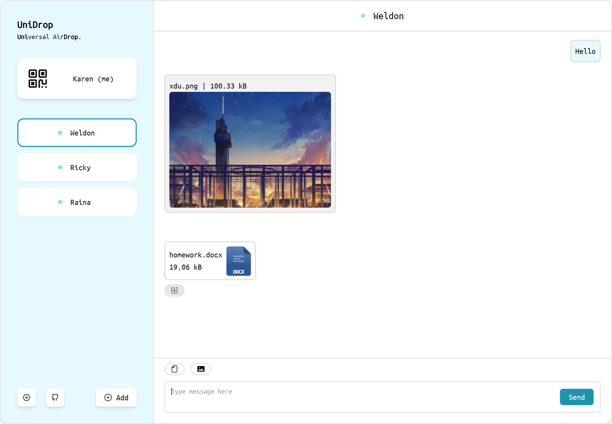
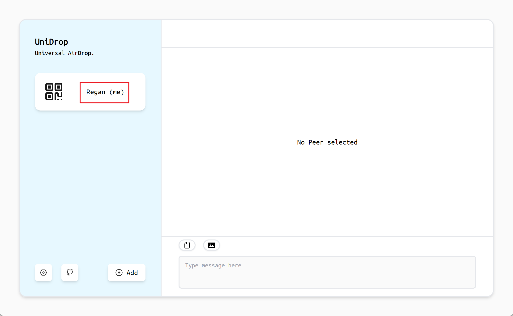

# UniDrop

[English](./README.md) | 简体中文

`UniDrop` 指 "Universal AirDrop"，可以在不同设备之间便捷地传输文本、图片、文件。

## 快速开始

访问 [unidrop.top](https://www.unidrop.top) 即可使用。

## 功能特性

- 基于 Web，无需安装应用
- 基于 WebRTC，p2p 连接建立后不需服务器中转，充分利用(内网)带宽
- 支持传输 文本、图片、文件 消息
- 支持多种节点发现机制：局域网、二维码、Pin、URL、PeerID
- 不需要注册，开箱即用

## 使用方法

### 前提条件

- 使用主流浏览器 (Chrome, Firefox 等)
- 设备可以连接公网

### 节点初始化

网页被打开后，会自动初始化节点。完成初始化后，会显示节点的名称。

如下图所示，节点名称为 `Regan`。

### 节点发现

可以使用多种方式，建立不同设备之间的连接。

#### 局域网

当设备处于同一局域网时，可以使用局域网发现节点。

设备A 和 设备B 都打开 [unidrop.top](https://www.unidrop.top)，等待 10 秒左右，设备A 和 设备B 会自动发现对方。

#### 二维码

设备A 点击 me，向 设备B 展示二维码

设备B 扫描 设备A 展示的二维码

#### Pin

Pin 码是 4 位数字，可以很方便的说出来或者输入。

设备A 点击 me，将 Pin 码发送给设备 B

设备B 点击 Add，输入 Pin 码

#### URL

设备A 点击 me，将 URL 发送给设备 B

设备B 打开 URL

#### PeerID

设备A 点击 me，将 PeerID 发送给设备 B

设备B 点击 Add，输入 PeerID

### 发送消息

首先需要选中目标节点，并确保连接状态正常（绿色小圆点）。

- 发送文本消息

  在输入框中输入文本后，点击 Send 按钮 / 按下回车键，即可发送文本消息。

- 发送文件消息

  点击工具栏的文件选择按钮，选择文件后，即可发送文件消息。

- 发送图片消息

  点击工具栏的图片选择按钮，选择图片后，即可发送图片消息。接受者可以在聊天窗口中预览图片，也可以下载图片。

## 部署

如果需要自己部署 `UniDrop`，可以参考 [部署文档](./docs/deploy.md)。

## 开发

如果需要开发 `UniDrop`，可以参考 [开发文档](./docs/develop.md)。

## 致谢

[ChatGPT-Next-Web](https://github.com/Yidadaa/ChatGPT-Next-Web) 提供了 UI 设计的灵感和一些 svg 图标。
